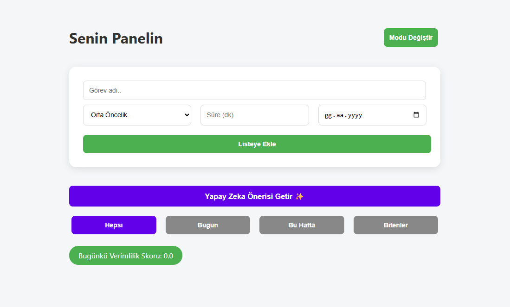

# 🚀 Akıllı Günlük Planlayıcı

Bu proje, öğrencilerin ve profesyonellerin günlük görevlerini önem sırasına göre yönetmelerine yardımcı olan, **yapay zeka algoritmalı** bir web uygulamasıdır.

  

## ✨ Özellikler
* **Akıllı Sıralama:** Görevler; öncelik, süre ve teslim tarihine göre özel bir algoritma ile puanlanır.
* **Yapay Zeka Önerisi:** "Yapay Zeka Önerisi Getir" butonu, o an yapmanız gereken en verimli görevi sizin için otomatik olarak seçer ve vurgular.
* **Verimlilik Takibi:** Günlük tamamladığınız görevlerden kazandığınız puanlarla "Verimlilik Skorunuzu" anlık olarak takip edebilirsiniz.
* **Kişiye Özel Deneyim:** Veriler tamamen kullanıcının tarayıcısında (**LocalStorage**) saklanır. Bu sayede her kullanıcı sadece kendi verilerini görür ve veriler başkalarıyla karışmaz.
* **Gelişmiş Filtreleme:** Görevlerinizi Bugün, Bu Hafta ve Bitenler olarak kolayca kategorize edebilirsiniz.
* **Koyu/Açık Mod:** Göz yorgunluğunu önleyen ve kullanıcı tercihine göre kaydedilen gece modu desteği mevcuttur.
* **Mobil Uyumlu:** Responsive (duyarlı) tasarım sayesinde telefon, tablet ve bilgisayarlarda sorunsuz bir deneyim sunar.

## 🛠 Kullanılan Teknolojiler
* **HTML5:** Sayfa yapısı ve semantik içerik.
* **CSS3:** Modern UI/UX tasarımı, Flexbox ve CSS Değişkenleri (Variables).
* **JavaScript (ES6+):** LocalStorage API, tarih işleme algoritmaları ve dinamik DOM yönetimi.

## 📖 Nasıl Kullanılır?
1. **Görev Ekleme:** Görev adını yazın, önceliğini belirleyin, süresini ve teslim tarihini seçip "Listeye Ekle" butonuna basın.
2. **Öneri Alma:** Hangi işten başlayacağınıza karar veremiyorsanız "Yapay Zeka Önerisi Getir" butonuna tıklayarak en önemli işinizi görün.
3. **Filtreleme:** Üstteki butonları kullanarak sadece bugünün işlerine veya bitenlere odaklanın.
4. **Tamamlama:** Bir görevi bitirdiğinizde "Bitir" butonuna basarak verimlilik skorunuzu yükseltin!

---

### 💡 Geliştirici Notu
Bu uygulama, yazılım stajı kapsamında temel web teknolojilerinin gerçek dünya problemlerine (zaman yönetimi) uygulanması amacıyla geliştirilmiştir. Tamamen istemci taraflı (client-side) çalıştığı için hızlı ve güvenlidir.

---
